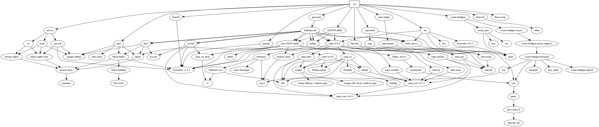

#**Zei: Findora's Cryptographic Library**

Zei is a library that provide tools to create and verify public transaction
with confidential data.

Support:

- Basic Cryptographic tools:
  - ElGamal Encryption in the exponent over generic groups.
  - A Naive Multisignature (concatenation of ed25519 signatures)
  - BLS multisignatures (not currently integrated with Xfr creation)
  - Hybrid Encryption using signature key
- Advanced Cryptographic tools:
  - Anonymous Credentials based on David Pointcheval and Olivier Sanders.
    Short Randomizable Signatures. CT RSA 2015. https://eprint.iacr.org/2015/525.pdf.
    It currently uses BLS12_381 as the underlying pairing
  - Confidential Anonymous Credential Reveal: Allows to encrypt credential attributes
    so that a verifier can check a credential signature without learning the attributes.
    This functionality allows for identity attributes tracking over a public ledger.
  - Chaum Pedersen proofs: Allows to prove in zero-knowledge that a set of Pedersen
    commitments open to the same value. Used in transfers to prove that the input confidential asset
    is the same as the output asset type.
  - Pedersen-ElGamal Equality Proofs: Allows to prove in zero-knowledge that the
    decryption of an Elgamal ciphertexts correctly opens a pedersen commitment.
    Use in transfers that allow tracking amounts and asset type without publicly
    revealing these values.
  - Dlog: Simple proof of knowlege of discrete logarithms over generic groups.
- Xfr multi-input multi-output UTXO transfers
  - Plain: XfrNote reveal amount and asset type
  - Confidential amount and/or asset type: XfrNote hides amount and/or asset type
  - AssetType mixing: Allows for multiple asset types in a confidential transaction
    Implemented via the Cloak protocol. Currently using Interstellar spacesuite prototype
  - Tracking policies: Allow tracking of amount, asset type, and/or identity
    of asset holders. That is, confidential Xfrs need to provide ciphertexts of
    amount/asset_type and/or identity and prove that this are correctly formed.

# Benchmarks

## Use the benchmarks

Benchmarks are available for XfrNote operations. To run them all:

```shell
cargo bench
```

The report is available at `target/criterion/report/index.html`.

To run a specific benchmark:

```shell
cargo bench --bench {xfr_batch | xfr_{note|body}_{noidtracking|idtracking}_{assettracking|noassettracking}_{singleasset|multiasset}}_{time|cycles}
```

For example to run the benchmark for xfr notes with identity tracking, and no asset tracking for a single asset, run:

```shell
cargo bench --bench xfr_note_idtracking_noassettracking_singleasset_time
```

The benchmarks involving batch verification can be run with:

```shell
cargo bench --bench xfr_note_batch_time
```

Note that not all the combinations are implemented yet. So far the benchmarks available are
(replace `time`by `cycles` if you want the # of cpu cycles instead of seconds):

- `xfr_note_noidtracking_noassettracking_singleasset_time`
- `xfr_note_idtracking_noassettracking_singleasset_time`
- `xfr_note_idtracking_assettracking_multiasset_time`
- `xfr_note_idtracking_assettracking_singleasset_time`
- `xfr_body_idtracking_assettracking_singleasset_time`
- `xfr_note_batch_time`

# Development environment setup

## Install RUST

Run the following script and select option 1)

```shell
curl --proto '=https' --tlsv1.2 -sSf https://sh.rustup.rs | sh
```

## Git

We use special hooks before committing. To enable these hooks, copy them to the `.git`
directory:

```shell
cp hooks/pre-commit .git/hooks/
```

## Tests

The tests generate some parameters which are stored in the directory `zei_api/data`.
If the tests fail, try first to remove the `*.bin` files in this directory and launch the tests again.

We recommend using the option `--release` for tests faster execution.

Run all the tests:
```shell
cargo test --all --release
```

Run only the documentation tests:
```shell
cargo test --doc --release
```

### Test coverage

[Tarpaulin](https://github.com/xd009642/tarpaulin) is a test coverage tool for Rust.
Note that Tarpaulin only supports x86_64 processors running Linux.

Install Tarpaulin:

```shell
cargo install cargo-tarpaulin
```

Run Tarpaulin, using a timeout of 120 seconds.

```shell
cargo tarpaulin --timeout 120
```

## Generate and read the documentation

### Standard

```shell
cargo doc --open
```

### Visualize dependencies

#### Cargo tree

This tool allows to visualizes crates' dependencies as a tree.

To install:

```shell
cargo install cargo-tree
```

To run:

```shell
cargo tree
```

#### Cargo deps

This tool allows to visualizes crates' dependencies as a graph.

First you need to install graphviz.

For ubuntu:

```shell
sudo apt install graphviz
```

Then install cargo-deps:

```shell
cargo install cargo-deps
```

Generate the graph of dependencies as an image:

```shell
cargo deps --no-transitive-deps | dot -Tpng > graph.png
```



## Code formatting

Use the following command to install rustfmt, the tool that allows to format the code
according to some agreed standard defined in `rustfmt.toml`.

```shell
rustup component add rustfmt
rustup self update
```

Then to format your code run

```shell
cargo fmt
```

# Use of zei library

To install, add the following to your project's `Cargo.toml`:

```toml
[dependencies.zei]
version = "v0.1.4d"
```

Then, in your library or executable source, add:

## Import zei library

```rust
extern crate zei;
```

By default, several `zei`'s tools uses `curve25519-dalek`'s `u64_backend`
feature, which uses Rust's `i128` feature to achieve roughly double the speed as
the `u32_backend` feature. When targetting 32-bit systems, however, you'll
likely want to compile with
`cargo build --no-default-features --features="u32_backend"`.
If you're building for a machine with avx2 instructions, there's also the
experimental `avx2_backend`. To use it, compile with
`RUSTFLAGS="-C target_cpu=native" cargo build --no-default-features --features="avx2_backend"`

## Point to a branch of zei

If you want your project to point to a specific branch of zei do the following:

- Edit `Cargo.toml` and replace the line (assume the branch name is _refactor/api-module_)

```toml
zei = { git = "https://github.com/FindoraNetwork/zei"}
```

by

```toml
zei = { git = "https://github.com/FindoraNetwork/zei", tag = "v0.1.4d" }
```


## Licensing

The primary license for Zei is the Business Source License 1.1 (`BUSL-1.1`), see [`LICENSE`](./LICENSE).
